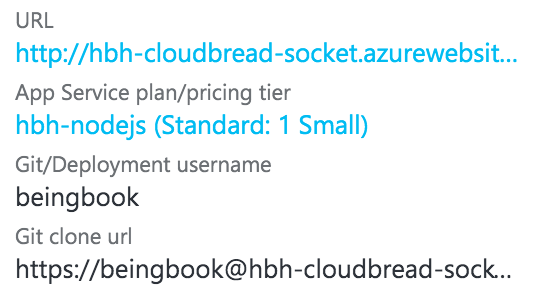
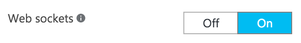
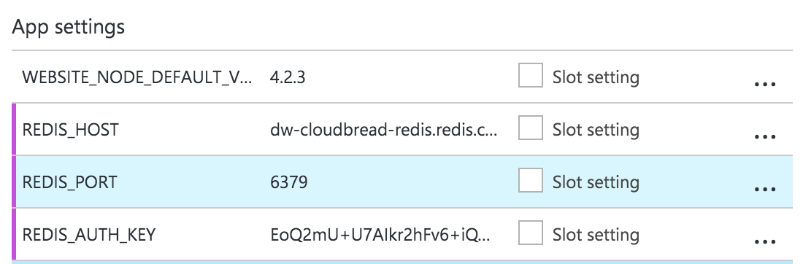

이 문서는 실시간 양방향 통신을 위한 [CloudBread-Socket](https://github.com/CloudBreadProject/CloudBread-Socket)프로젝트 설치 방법에 대해 기술합니다.

## 준비사항
* Node.js 4.x or 5.x 이상 및 NPM 3.x 이상 [다운로드 링크](https://nodejs.org/en/)
* Git Client [다운로드 링크](https://git-scm.com/downloads)

**tip**
과거에 Node.js를 설치한 경우 버전이 낮아 지원되지 않을 수 있습니다.
명령 프롬포트(윈도우)나 터미널(Unix)를 켜고 `node -v`, `npm -v` 명령어를 입력해서 버전을 확인할 수 있습니다.

### 패키지 설치
```sh
git clone https://github.com/CloudBreadProject/CloudBread-Socket.git
cd CloudBread-Socket
npm i
```
*위 과정이 성공적으로 끝났으면 `node_modules`라는 폴더가 생겼을 것입니다.*

### 패키지 테스트
```sh
npm test
```
아래와 같이 결과가 나온다면 완벽합니다.

```sh
> mocha tests/* --require babel-core/register --require babel-polyfill --require ./tests/helper --recursive


The server is listening at http://localhost:8111
  Server
    ✓ is a object
    ✓ says hello worlds!


  2 passing (123ms)
```

에러가 발생할 경우 제대로 설치가 되지 않은 것입니다.

### 로컬 테스트 환경구성
```sh
npm start
```
이 명령어는 앱을 실제 서비스하기 전에 로컬에서 테스트 환경을 구축할때 유용합니다.
기본적으로 `8222`포트에 서버가 열립니다.
`tools/config.js` 파일의 PORT 상수를 수정하거나
```sh
npm start -- --port 8888
```
명령어에 `--port` 인자를 부여해서 포트를 변경할 수 있습니다.

### 패키지 배포
`tools/tasks/deploy.js`를 VI, Atom, Sublime Text, EditPlus, Notepad++ 등의 텍스트 에디터로 엽니다.
12~16번줄 사이에 다음과 같은 내용이 있을 것입니다.
```js
  const remote = {
    name: 'azure',
    url: 'https://beingbook@hbh-cloudbread-socket.scm.azurewebsites.net:443/hbh-cloudbread-socket.git',
    website: 'http://hbh-cloudbread-socket.azurewebsites.net',
  };
```
위 항목에서 url, website 항목을 본인의 환경에 맞게 수정합니다.
url은 웹앱과 연결된 레포지토리의 주소, website는 웹앱의 주소입니다.

위 이미지에서 `URL` => `website`, `Git clone url` => `url` 입니다.

애져 웹 관리자 포털에서 웹앱 설정으로 접근합니다.

소켓을 `Off`에서 `On`으로 변경합니다.


수정이 끝났으면 다음 명령어를 실행합니다.
```sh
npm run deploy
```
이후 패키지를 자동으로 `Production` 형태로 빌드한 뒤 Git 클라이언트를 통해 연결된 주소로 배포합니다.
배포하는 컴퓨터에 배포 서버와 연결된 SSH Key가 없다면 패스워드를 물어볼 것입니다.

#### Redis 연동
이 항목은 실제 서비스할 때 설정이 필요합니다.
단순 테스트 단계에서는 이 단계를 수행하실 필요가 없습니다.

애져 웹 관리자 포털에서 웹앱 설정으로 접근합니다.

앱 설정에 다음과 같은 환경 변수를 추가합니다.

`REDIS_HOST` => 레디스 호스트 주소
`REDIS_PORT` => 레디스 포트
`REDIS_AUTH_KEY` => 레디스 인증 키

이후 앱을 재시작하면 유저가 접속할 때 토큰을 요구합니다.
CB에서 인증할 경우 레디스에 자동으로 토큰이 생기며 해당 토큰을 접속시 같이 전달해주면 됩니다.